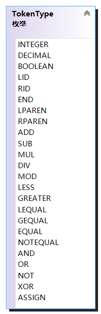
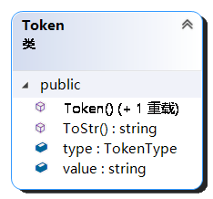
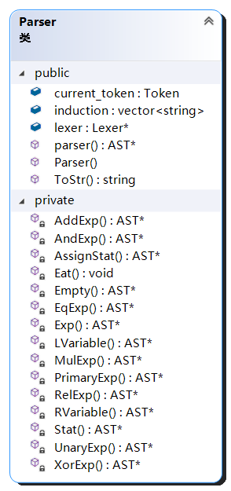
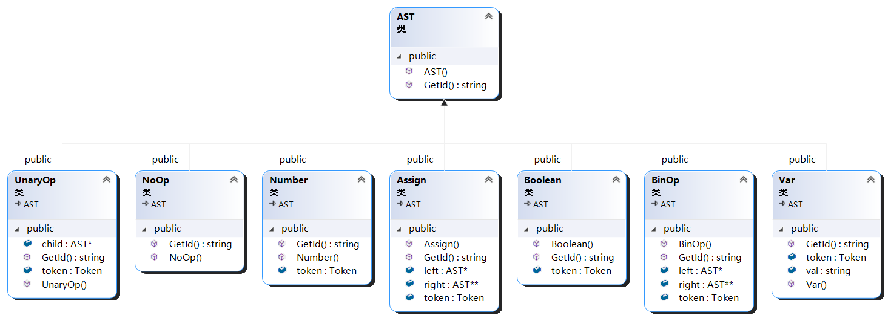
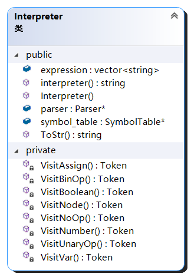
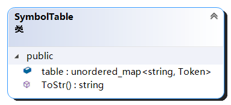
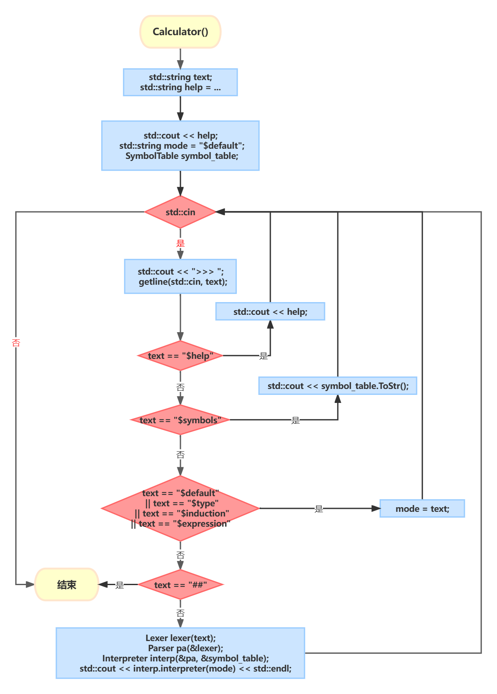

# 表达式解析器

西北大学（NWU）编译原理/编译技术实践作业表达式解析器；
如果觉得有用或者写的还不错的话点个 Star 呗。

- [表达式解析器](#表达式解析器)
  - [1. 系统描述](#1-系统描述)
    - [1.1 系统功能](#11-系统功能)
    - [1.2 实现语言和平台](#12-实现语言和平台)
  - [2. 系统分析和设计](#2-系统分析和设计)
    - [2.1 词法分析](#21-词法分析)
      - [2.1.1 TokenType 定义](#211-tokentype-定义)
      - [2.1.2 Token 类定义](#212-token-类定义)
      - [2.1.3 Lexer 类定义](#213-lexer-类定义)
    - [2.2 语法分析](#22-语法分析)
      - [2.2.1 抽象语法树 AST 类定义](#221-抽象语法树-ast-类定义)
      - [2.2.2 语法分析器 Parser 类定义](#222-语法分析器-parser-类定义)
    - [2.3 语义分析和翻译](#23-语义分析和翻译)
      - [2.3.1 Interpreter 类定义](#231-interpreter-类定义)
    - [2.4 符号表设计](#24-符号表设计)
      - [2.4.1 符号表 SymbolTable 类定义](#241-符号表-symboltable-类定义)
    - [2.5 分析和设计模型](#25-分析和设计模型)
      - [2.5.1 类图](#251-类图)
      - [2.5.2 计算器主函数流程图](#252-计算器主函数流程图)
  - [3. 系统实现](#3-系统实现)
    - [3.1 源代码清单](#31-源代码清单)
    - [3.2 可执行程序](#32-可执行程序)
  - [4. 系统测试和评估报告](#4-系统测试和评估报告)
    - [4.1 系统测试记录和分析报告](#41-系统测试记录和分析报告)
      - [4.1.1 测试记录](#411-测试记录)
        - [正确表达式测试](#正确表达式测试)
        - [类型兼容和转换](#类型兼容和转换)
        - [输出格式配置命令](#输出格式配置命令)
        - [存在错误的表达式](#存在错误的表达式)
      - [4.1.2 分析报告](#412-分析报告)
    - [4.2 系统评估和评价](#42-系统评估和评价)
  - [参考](#参考)

## 1. 系统描述

一个简易的表达式解析器。

### 1.1 系统功能

（1）以命令行方式解析用户输入的表达式，计算并显示结果，并按指定格式输出；  
（2）支持基本的整型和浮点类型数值计算，布尔表达式和关系运算表达式的计算；  
（3）支持使用变量和存储计算结果、变量引用，变量类型无需声明，根据其中保存的数据变化；  
（4）浮点数支持10位有效数字。  

### 1.2 实现语言和平台

语言：C++  
平台：Visual Studio 2019  

## 2. 系统分析和设计

### 2.1 词法分析

#### 2.1.1 TokenType 定义

整数，浮点数，布尔值，左值变量，右值变量，结束标志，  
左括号，右括号，  
加号，减号，乘号，除号，取模，  
小于，大于，小于等于，大于等于，等于，不等于，  
与，或，非，异或，  
赋值运算

```cpp {.line-numbers}
enum TokenType {
 INTEGER, DECIMAL, BOOLEAN, LID, RID, END,
 LPAREN, RPAREN,
 ADD, SUB, MUL, DIV, MOD,
 LESS, GREATER, LEQUAL, GEQUAL, EQUAL, NOTEQUAL,
 AND, OR, NOT, XOR,
 ASSIGN
};
```

#### 2.1.2 Token 类定义

```cpp {.line-numbers}
class Token
{
public:
 Token() = default;
 Token(TokenType t, std::string v) :type{ t }, value{ v }{}
 TokenType type;     // 类型
 std::string value;  // 值
 std::string ToStr();// 将type和value转string输出
};
```

#### 2.1.3 Lexer 类定义

```cpp {.line-numbers}
class Lexer
{
public:
 Lexer(std::string t) :text{ t }, pos{ 0 }, current_char{ text[pos] }{}
 std::string ToStr();//该函数供测试用，返回当前输入解析出的Token序列。
 Token GetNextToken();//获取下一个Token
private:
 std::string text;//输入的表达式
 unsigned long pos;//当前字符下标
 char current_char;//当前字符

 Token Number();//处理数值
 Token IdBoolean();//处理变量名和布尔类型
 void Advance(int step = 1);//前进
 char Peek();//查看下一个字符
 void SkipSpace();//跳过空格
};
```

核心函数为 ```GetNextToken()``` ，它通过当前字符判断其所属的 Token 类型。
对于单个字符的 Token 例如：+，-，直接返回即可；  
对于双字符的 Token 例如：==，!=，>=，则需要使用 ```Peek()``` 函数帮助判断类型；  
对于数字，则调用 ```Number()``` 函数，```Number()``` 函数中使用一个简单的 DFA 识别数字是整数或浮点数；  
对于字母，调用 ```IdBoolean()``` 函数，对于 false 和 true 的字符，返回 BOOLEAN 类型的 Token ，否则，判断下一个字符是否为"="，且下下一个字符是否不为"="，这样可以识别出输入的是左值变量还是右值变量并返回。其他实现细节见附件代码。
main.cpp 中的 ```TestLexer()``` 函数可以进行词法分析器测试，运行结果如下：  

```txt
TestLexer:
a = aname+1-2.3*4/5%  6 (1+2)==!=<<=>>=true false && || ! ^
LID, a
ASSIGN, =
RID, aname
ADD, +
INTEGER, 1
SUB, -
DECIMAL, 2.3
MUL, *
INTEGER, 4
DIV, /
INTEGER, 5
MOD, %
INTEGER, 6
LPAREN, (
INTEGER, 1
ADD, +
INTEGER, 2
RPAREN, )
EQUAL, ==
NOTEQUAL, !=
LESS, <
LEQUAL, <=
GREATER, >
GEQUAL, >=
BOOLEAN, true
BOOLEAN, false
AND, &&
OR, ||
NOT, !
XOR, ^
```

所有测试结果均符合预期（只测试词法分析），词法分析完成。  

### 2.2 语法分析

语法分析通过建立抽象语法树实现。文法定义如下：

```txt
Stat -> AssignStat | Exp
AssignStat -> LVariable = Exp
LVariable -> LID
Exp -> AndExp 
        | Exp || AndExp
AndExp -> XorExp 
        | AndExp && XorExp
XorExp -> EqExp 
        | XorExp ^ EqExp
EqExp -> RelExp
        | EqExp == RelExp
        | EqExp != RelExp
RelExp -> AddExp
        | RelExp < AddExp
        | RelExp > AddExp
        | RelExp <= AddExp
        | RelExp >= AddExp
AddExp -> MulExp
        | AddExp + MulExp
        | AddExp - MulExp
MulExp -> UnaryExp
        | MulExp * UnaryExp
        | MulExp / UnaryExp
        | MulExp % UnaryExp
UnaryExp -> PrimaryExp
        | + UnaryExp
        | - UnaryExp
        | ! UnaryExp
PrimaryExp -> ( Exp )
        | INTEGER
        | DECIMAL
        | BOOLEAN
        | RVariable
RVariable -> RID
```

消除左递归后的文法（简写）：

```txt
Stat -> AssignStat | Exp
AssignStat -> LVariable = Exp
LVariable -> LID
Exp -> AndExp ('||' AndExp)*
AndExp -> XorExp ('&&' XorExp)*
XorExp -> EqExp ('^' EqExp)*
EqExp -> RelExp (('=='|'!=') RelExp)*
RelExp -> AddExp (('>'|'<'|'<='|'>=') AddExp)*
AddExp -> MulExp (('+'|'-') MulExp)*
MulExp -> UnaryExp (('*'|'/'|'%') UnaryExp)*
UnaryExp -> PrimaryExp | ('+'|'-'|'!') UnaryExp
PrimaryExp -> '('Exp')'|INTEGER|DECIMAL|BOOLEAN|RVariable
RVariable -> RID
```

容易验证，各产生式的 First 集合没有交集，下面使用递归下降进行语法分析。

#### 2.2.1 抽象语法树 AST 类定义

```cpp {.line-numbers}
class AST {
public:
 AST() = default;
 virtual std::string GetId() = 0;
};
```

AST 类有如下派生类：

```cpp {.line-numbers}
//赋值节点
class Assign : public AST {
public:
 Assign(AST* l, Token t, AST* r) : token(t), left(l), right(r) {}
 Token token;
 AST* left, * right;
 std::string GetId() { return "Assign"; }
};
//二元运算符节点
class BinOp : public AST {
public:
 BinOp(AST* l, Token t, AST* r) : token(t), left(l), right(r) {}
 Token token;
 AST* left, * right;
 std::string GetId() { return "BinOp"; }
};
//一元运算符节点
class UnaryOp : public AST {
public:
 UnaryOp(Token t, AST* child) : token(t), child(child) {}
 Token token;
 AST* child;
 std::string GetId() { return "UnaryOp"; }
};
//数值节点
class Number : public AST {
public:
 Number(Token t) : token(t) {}
 Token token;
 std::string GetId() { return "Number"; }
};
//布尔值节点
class Boolean : public AST {
public:
 Boolean(Token t) : token(t) {}
 Token token;
 std::string GetId() { return "Boolean"; }
};
//变量节点
class Var : public AST {
public:
 Var(Token t) : token(t), val(t.value) {}
 Token token;
 std::string val;
 std::string GetId() { return "Var"; }
};
```

每个派生类中都重写 GetId() 函数，供后续遍历节点时调用。  

#### 2.2.2 语法分析器 Parser 类定义

```cpp {.line-numbers}
class Parser
{
public:
 Parser(Lexer* le) : lexer{ le }, current_token{ lexer->GetNextToken() } {}
 Lexer* lexer;// 传入一个词法分析器
 Token  current_token;// 当前的Token
 AST* parser();// 抽象语法树起点
 std::string ToStr();//induction转字符串输出，用于测试
 std::vector<std::string> induction;//产生式的推导记录
private:
 void  Eat(TokenType token_type);//消耗一个Token，如果不符合传入的参数，将报错
 AST* Stat();
 AST* AssignStat();
 AST* Exp();
 AST* AndExp();
 AST* XorExp();
 AST* EqExp();
 AST* RelExp();
 AST* AddExp();
 AST* MulExp();
 AST* UnaryExp();
 AST* PrimaryExp();
 AST* LVariable();
 AST* RVariable();
 AST* Empty();
};
```

递归下降分析器要求给每条产生式都定义一个函数，如上。
语法分析从 parser() 函数开始，根据文法定义，调用其他的函数。
以 EqExp() 函数为例，根据文法 ```EqExp -> RelExp (('=='|'!=') RelExp)*``` ，不难理解以下的代码过程。  
首先，induction中加入产生式（如果这个函数被调用，必然存在一条产生式 ```EqExp -> RelExp``` ）然后，根据当前Token的类型，加入新的产生式，创建一个二元运算符节点，。其他产生式的函数代码与此类似。

完整地消除左递归实际上一般会导致多出一条产生式，即需要多定义一个函数，但是多出的函数在代码中可以和之前函数合并为下面的形式，因此代码对应的产生式实际是 ```EqExp -> RelExp (('=='|'!=') RelExp)*```，实践报告中要求可以给出推导产生式，因此 ```induction.push_back()``` 仍是加入未消除左递归的产生式，可考虑修改代码，使其可以加入消除左递归形式的产生式。

```cpp {.line-numbers}
AST* Parser::EqExp()
{
 induction.push_back("EqExp -> RelExp");
 AST* res = RelExp();
 while (current_token.type == EQUAL || current_token.type == NOTEQUAL) {
  if (current_token.type == EQUAL) {
   induction.push_back("EqExp -> EqExp == RelExp");
   Eat(EQUAL);
   AST* right = RelExp();
   res = new BinOp(res, Token(EQUAL, "=="), right);
  }
  else if (current_token.type == NOTEQUAL) {
   induction.push_back("EqExp -> EqExp != RelExp");
   Eat(NOTEQUAL);
   AST* right = RelExp();
   res = new BinOp(res, Token(NOTEQUAL, "!="), right);
  }
 }
 return res;
}
```

与词法分析类似，main.cpp中语法分析的的测试函数 ```TestParser()``` 运行结果如下：

```txt
TestParser:
a=1+2.3-4*5/6
[ Stat -> AssignStat, AssignStat -> LVariable = Exp, 
LVariable -> LID, Exp -> AndExp, 
AndExp -> XorExp, XorExp -> EqExp, 
EqExp -> RelExp, RelExp -> AddExp, 
AddExp -> MulExp, MulExp -> UnaryExp, 
UnaryExp -> PrimaryExp, PrimaryExp -> INTEGER, 
AddExp -> AddExp + MulExp, MulExp -> UnaryExp, 
UnaryExp -> PrimaryExp, PrimaryExp -> DECIMAL, 
AddExp -> AddExp - MulExp, MulExp -> UnaryExp, 
UnaryExp -> PrimaryExp, PrimaryExp -> INTEGER, 
MulExp -> MulExp * UnaryExp, UnaryExp -> PrimaryExp, 
PrimaryExp -> INTEGER, MulExp -> MulExp / UnaryExp, 
UnaryExp -> PrimaryExp, PrimaryExp -> INTEGER, ]
```

存在的问题：产生式的顺序有一点点不对，如第七条产生式：```AddExp -> MulExp``` 本应出现在较靠后的位置，这是由于产生式的函数代码的局限性，必须先加入这条产生式。可以考虑采用别的非线性结构存储产生式再输出。总体上语法用到的产生式均成功输出，语法分析完成。

### 2.3 语义分析和翻译

使用S属性的SDD进行翻译，语义规则如下：

| 产生式 |语义规则 |
|:---|:---|
|$Stat \rightarrow AssignStat$|$Stat.val = AssignStat.val$|
|$Stat \rightarrow Exp$|$Stat.val = Exp.val$|
|$AssignStat \rightarrow LVariable = Exp$|$AssignStat.val = Exp.val$|
|$LVariable \rightarrow \textbf{LID}$|$LVariable = \textbf{LID}.val$|
|$Exp \rightarrow {Exp}_1 \; \| \; AndExp$|$Exp = {Exp}_1.val \; \| \; AndExp.val$|
|$Exp \rightarrow AndExp$|$Exp.val = AndExp.val$|
|$AndExp \rightarrow {AndExp}_1 \; \&\& \; XorExp$ |$AndExp.val={AndExp}_1.val \; \&\& \; XorExp.val$ |
|$AndExp \rightarrow XorExp $|$AndExp.val = XorExp.val $|
|$XorExp \rightarrow {XorExp}_1 \land EqExp$|$XorExp.val = {XorExp}_1.val \land EqExp.val$|
|$XorExp \rightarrow EqExp$|$XorExp.val = EqExp.val$|
|$EqExp \rightarrow {EqExp}_1 == RelExp$|$EqExp.val={EqExp}_1.val == RelExp.val$|
|$EqExp \rightarrow {EqExp}_1 \; != \; RelExp$|$EqExp.val={EqExp}_1.val \; != \; RelExp.val$|
|$EqExp \rightarrow RelExp$|$EqExp.val = RelExp.val$|
|$RelExp \rightarrow {RelExp}_1 < AddExp $|$RelExp.val = {RelExp}_1.val < AddExp.val $|
|$RelExp \rightarrow {RelExp}_1 > AddExp $|$RelExp.val={RelExp}_1.val > AddExp.val $|
|$RelExp \rightarrow {RelExp}_1 <= AddExp $|$RelExp.val = {RelExp}_1.val <= AddExp.val $|
|$RelExp \rightarrow {RelExp}_1 >= AddExp $|$RelExp.val = {RelExp}_1.val >= AddExp.val $|
|$RelExp \rightarrow AddExp $|$RelExp.val = AddExp.val $|
|$AddExp \rightarrow {AddExp}_1 + MulExp$|$AddExp.val={AddExp}_1.val + MulExp.val$|
|$AddExp \rightarrow {AddExp}_1 - MulExp$|$AddExp.val={AddExp}_1.val - MulExp.val$|
|$AddExp \rightarrow MulExp$|$AddExp.val = MulExp.val$|
|$MulExp \rightarrow {MulExp}_1\;*\; UnaryExp$|$MulExp.val={MulExp}_1.val\times UnaryExp.val$|
|$MulExp \rightarrow {MulExp}_1\;/\; UnaryExp$|$MulExp.val={MulExp}_1.val\;/\; UnaryExp.val$|
|$MulExp \rightarrow {MulExp}_1\;\%\; UnaryExp$|$MulExp.val={MulExp}_1.val\;\%\; UnaryExp.val$|
|$MulExp \rightarrow  UnaryExp$|$MulExp.val =  UnaryExp.val$|
|$UnaryExp \rightarrow +\; UnaryExp $|$UnaryExp.val = UnaryExp.val $|
|$UnaryExp \rightarrow -\; UnaryExp $|$UnaryExp.val = -\; UnaryExp.val$|
|$UnaryExp \rightarrow\; !\; UnaryExp$|$UnaryExp.val =\; !\; UnaryExp.val$|
|$UnaryExp \rightarrow PrimaryExp $|$UnaryExp.val= PrimaryExp.val $|
|$PrimaryExp \rightarrow (\; Exp\; ) $|$PrimaryExp.val= Exp.val $  |
|$PrimaryExp \rightarrow \textbf{INTEGER}$|$PrimaryExp.val =\textbf{INTEGER}.val$|
|$PrimaryExp \rightarrow \textbf{DECIMAL}$|$PrimaryExp.val =\textbf{DECIMAL}.val$|
|$PrimaryExp \rightarrow \textbf{BOOLEAN}$|$PrimaryExp.val =\textbf{BOOLEAN}.val$|
|$PrimaryExp \rightarrow RVariable       $|$PrimaryExp.val = RVariable.val      $|
|$RVariable \rightarrow \textbf{RID}     $|$RVariable.val = \textbf{RID}.val    $|

代码实现过程中为了考虑类型匹配问题，直接将 Token 作为综合属性返回值传递给上层节点。

#### 2.3.1 Interpreter 类定义

```cpp {.line-numbers}
class Interpreter 
{
public:
 Interpreter(Parser* par, SymbolTable* s) { parser = par; symbol_table = s; }
 Parser* parser;
 SymbolTable* symbol_table;

 std::string interpreter(std::string mode);//根据不同模式返回不同的结果
 std::string ToStr();
 std::vector<std::string> expression;//计算过程
private:
 Token VisitNode(AST* node);//根据传入的node->GetId()确定调用下面的哪个函数
 Token VisitNumber(Number* node);//遍历数值节点
 Token VisitBoolean(Boolean* node);
 Token VisitVar(Var* node);
 Token VisitBinOp(BinOp* node);//遍历二元运算符节点
 Token VisitUnaryOp(UnaryOp* node);//遍历一元运算符节点
 Token VisitAssign(Assign* node);//赋值节点
 Token VisitNoOp(NoOp* node);//空节点
};
```

例如：  
对于数值节点，返回数值对应的类型 INTERGER 或 DECIMAL 的 Token；  
对于变量节点，如果是左值，将它插入到符号表内，如果是右值，则在符号表中查找该变量，返回变量对应的实际类型的 Token ，如果未找到，则报错；  
对于布尔节点，返回 BOOLEAN 类型的 Token；
对于二元运算符节点，根据传入的 Token 类型（加减乘除等等），进入到对于的分支，首先检查类型是否匹配，不匹配直接报错，匹配后再进行计算操作，将计算结果作为返回的 Token，以加法运算为例，部分代码如下：

```cpp {.line-numbers}
Token Interpreter::VisitBinOp(BinOp* node)
{
 Token left(VisitNode(node->left));
 Token right(VisitNode(node->right));
 switch ((node->token).type) {
 case ADD:
  if (left.type == INTEGER && right.type == INTEGER) {
   std::string res = std::to_string(stoi(left.value) + stoi(right.value));
   expression.push_back(res + " = " + left.value + " + " + right.value);
   return Token(INTEGER, res);
   break;
  }
  else if ((left.type == DECIMAL && right.type == DECIMAL)
     || (left.type == INTEGER && right.type == DECIMAL)
     || (left.type == DECIMAL && right.type == INTEGER)) {
   std::string res = DecimalToString(stod(left.value) + stod(right.value));
   expression.push_back(res + " = " + left.value + " + " + right.value);
   return Token(DECIMAL, res);
   break;
  }
  else {
   std::stringstream out;
   out << "Invalid ADD type !";
   throw(out.str());
  }
        ......
    }
}
```

这部分代码中包括了类型匹配：
对于子节点都是 INTERGER 的情况，返回值也是 INTERGER 类型，如果存在一个数是 DECIMAL 类型的，返回值则是 DECIMAL 类型，如果传入的类型不是数值，则报错。  
对于一元运算符节点，处理方法与二元类似，返回对应的正负或非的 Token 。
函数 ```std::string interpreter(std::string mode);``` 根据mode 的值输出对应的格式。

- \$default 只输出值；
- \$type 输出类型和值；
- \$induction 输出类型，值，推导产生式。
- \$expression 输出类型，值，计算过程。

main.cpp中语法分析的的测试函数 ```TestInterpreter()``` 运行结果如下：

```txt
TestInterpreter:
a=(1+2)*3/1.5
DECIMAL, 6
3 = 1 + 2, 9 = 3 * 3, 6 = 9 / 1.5, a = 6,
```

### 2.4 符号表设计

#### 2.4.1 符号表 SymbolTable 类定义

```cpp {.line-numbers}
class SymbolTable
{
public:
 std::unordered_map<std::string, Token> table;
 std::string ToStr();
};
```

类中主要是一个 unordered_map 类型的 table，变量名作为键，Token 作为值，使用 unordered_map 的优点是查找速度快，确定是存储无序，但符号表没有要求有序，因此使用哈希结构。
```ToStr()``` 函数输出 table 返回一个 string 。
该部分测试将在后续测试过程完成。

### 2.5 分析和设计模型

#### 2.5.1 类图



#### 2.5.2 计算器主函数流程图



## 3. 系统实现

### 3.1 源代码清单

头文件

- Token.h
- Lexer.h
- Parser.h
- Interpreter.h
- SymbolTable.h
- myfun.h

源文件

- Token.cpp
- Lexer.cpp
- Parser.cpp
- Interpreter.cpp
- SymbolTable.cpp
- myfun.cpp
- main.cpp

### 3.2 可执行程序

见 Interpreter\Debug\Interpreter.exe (直接运行需要Visual Studio 环境)

## 4. 系统测试和评估报告

### 4.1 系统测试记录和分析报告

#### 4.1.1 测试记录

##### 正确表达式测试

 ```txt
>>> 1+2*3/7
1
>>> 7-4*(2+5)
-21
>>> true && false || true
true
>>> true ^ false
true
>>> 1.2*3.7-4.8
-0.36
>>> 10/3
3
>>> 10.0/3
3.333333333
>>> a=3+4-5*7
-28
>>> a=a+1
-27
>>> b=45
45
>>> c=b+a
18
>>> $type
>>> c
INTEGER, 18
```

##### 类型兼容和转换

接上

```txt
>>> $type
>>> c
INTEGER, 18
>>> (2+2*3)/2%3
INTEGER, 1
>>> true && true
BOOLEAN, true
>>> true && false
BOOLEAN, false
>>> false || false
BOOLEAN, false
>>> false ^ false ^ false
BOOLEAN, false
>>> 2<=3
BOOLEAN, true
>>> 2>3
BOOLEAN, false
>>> 2.3!=2.3
BOOLEAN, false
>>> 1+2.3-4.89
DECIMAL, -1.59
>>> false + 2
Invalid ADD type !
>>> 2<3.5
BOOLEAN, true
>>> 12.0==12
BOOLEAN, true
>>> false < 1
Invalid Less than type !
>>> true >= 7
Invalid Greater equal type !
```

##### 输出格式配置命令

```txt
>>> $help
Enter $help to view help.
Enter $symnols to view the symbol table.
Four output modes to choose:
 $default   : Output value only.
 $type      : Output type and value.
 $induction : Output type, value and induction.
 $expression: Output type, value and expression.
Enter your expression.(enter ## to quit.)
>>> $type
>>> _qwer = false
BOOLEAN, false
>>> asd = 1.2*2.5
DECIMAL, 3
>>> $induction
>>> zhang = 2020 + 117
INTEGER, 2137
[ Stat -> AssignStat, AssignStat -> LVariable = Exp, 
LVariable -> LID, Exp -> AndExp, 
AndExp -> XorExp, XorExp -> EqExp, 
EqExp -> RelExp, RelExp -> AddExp, 
AddExp -> MulExp, MulExp -> UnaryExp, 
UnaryExp -> PrimaryExp, PrimaryExp -> INTEGER, 
AddExp -> AddExp + MulExp, MulExp -> UnaryExp, 
UnaryExp -> PrimaryExp, PrimaryExp -> INTEGER, ]
>>> $expression
>>> k = 2 + 0 + 7
INTEGER, 9
2 = 2 + 0, 9 = 2 + 7, k = 9,
>>> $symbols
******************************
 a      , INTEGER, -27
 b      , INTEGER, 45
 k      , INTEGER, 9
 c      , INTEGER, 18
 zhang  , INTEGER, 2137
 _qwer  , BOOLEAN, false
 asd    , DECIMAL, 3
******************************
>>> $default
>>> 1+1
2
```

##### 存在错误的表达式

```txt
>>> 318@736#9544
Invalid input : @ !
>>> *#06#
Input incomplete!
>>> #*#*
Invalid input : # !
>>> (1+2
Error input. Wanted: RPAREN
>>> 1.2+false
Invalid ADD type !
>>> 1*true
Invalid MUL type !
>>> 1/true
Invalid MUL type !
>>> 1%false
Invalid MOD type !
>>> 1&&false
Invalid AND type !
>>> 1&&2
Invalid AND type !
>>> 1||false
Invalid OR type !
>>> 2^true
Invalid XOR type !
>>> 1+jiangchengzi
jiangchengzi not found!
>>> 12 = 2
Last token type not END
>>> 3.12ha
Last token type not END
>>> 8hh+we
Last token type not END
>>> 你好
Invalid input : 你 !
```

#### 4.1.2 分析报告

正确的表达式，类型转换和兼容，命令帮助测试结果均正确，存在错误的表达式中，报错提示比较详细，但仍存在对于部分错误表达式，例如：

```txt
>>> 12 = 2
Last token type not END
```

错误提示不通俗易懂，后续可考虑改善代码。

### 4.2 系统评估和评价

所有测试点均无明显错误，系统测试过程中未出现闪退，报错，强制停止等问题，系统运行正常稳定，基本实现桌面计算器需求，并加入了 $expression 格式，可以输出表达式的计算过程。

一些bug修复记录

- 修复赋值号=左边不能有空格的bug；
- 浮点数支持10位有效数字；
- 修复不能处理类似a=a+1的bug；
- 修复中文输入bug，实际是C++中isdigit(),isnum(),isalnum(),isspace()函数不支持判断单个中文字符，中文占两位，使用传统方法重写即可；
- 新增支持变量名以下划线开头，但变量只能由字母数字下划线组成，且不能以数字开头。
- 新增\$expression，支持输出表达式的计算过程。
- ......

一些后记：
作者：信科20级张某人；
用时：大约一周；
邮箱：3187369544@qq.com;
转载请标明出处!!!
如果对你有帮助的话，可以选择支持一下：


> 本是后山人，偶做前堂客。醉舞经阁半卷书，坐井说天阔。
> 大志戏功名，海斗量福祸。论到囊中羞涩时，怒指乾坤错。

## 参考

[Let's Build A Simple Interpreter](https://github.com/rspivak/lsbasi)
[C++ version](https://github.com/yjhan96/lsbasi)